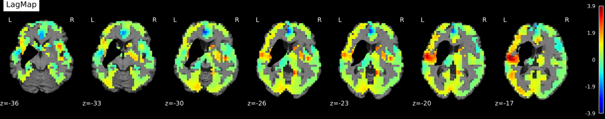
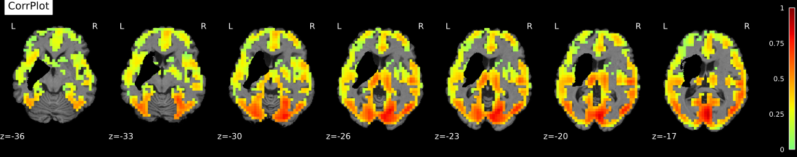
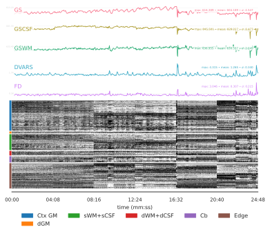
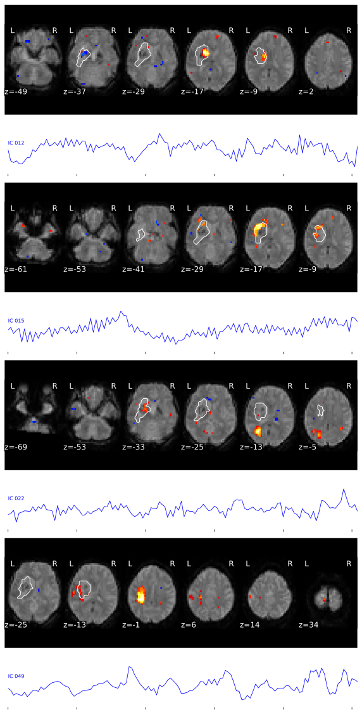

.. _outputs:

------------------------
Outputs of *fMRIStroke*
------------------------
*fMRIStroke* outputs conform to the :abbr:`BIDS (brain imaging data structure)`
Derivatives specification (see `BIDS Derivatives`, along with the
upcoming `BEP 011` and `BEP 012`).
*fMRIStroke* generates three broad classes of outcomes:

1. **Visual QA (quality assessment) reports**:
   one :abbr:`HTML (hypertext markup language)` per subject, that allows the user a visual assessment of the quality of preprocessing.
   If the output dir is the fmriprep dir then the fmriprep report will be updated with fmriStroke figures.

2. **Derivatives (preprocessed data)** the input fMRI data ready for
   analysis, i.e., after the various preparation procedures
   have been applied.

3. **Confounds**: Confounds signals that can be utilized
   to run subsequent denoising steps.

*fMRIStroke* can be either run run level, each run is preprocessed independently or session level with the tag ``--session-level``. In the latter case, 
preprocessed runs are concatenated and fMRIStroke pipeline is run on this new concatenated run (compcor regressors are computed for the new run).

Layout
------
Assuming fMRIStroke is invoked with::

    fmristroke <input_dir>/ <output_dir>/ participant --fmriprep-dir <derivatives_dir> [OPTIONS]

The outputs will be a `BIDS Derivatives`_ dataset of the form::

    <output_dir>/
      logs/
      sub-<label>/
      sub-<label>.html
      dataset_description.json
      .bidsignore

For each participant in the dataset,
a directory of derivatives (``sub-<label>/``)
and a visual report (``sub-<label>.html``) are generated.
``dataset_description.json`` is the metadata file in which fMRIPrep
records metadata recommended by the BIDS standard.

Visual Reports
--------------
*fMRIStroke* outputs summary reports, written to ``<output dir>/sub-<subject_label>.html``.
These reports make visual inspection of the results easy.
`View a sample report. <_static/SampleReport/sample_report.html>`_

   .. note::
       If the <output_dir> is the same as <fmirprep_dir> the fmriprep report will be updated with some visual report specific to lesions.
       Otherwise a report containing only lesion specific quality checks will be generated.

Coregistration
~~~~~~~~~~~~~~
The ROI mask (in red) is added to the coregistration plot.

Hemodynamics
~~~~~~~~~~~~
Stroke disrupts the brain's vascular supply, not only within but also outside areas of infarction.
[Siegel2016]_ investigated temporal delays (lag) in resting state functional magnetic resonance imaging signals and found that significant hemodynamic lag was observed in 30% of stroke patients sub-acutely and
approximately 10% of patients showed lag at one-year post-stroke. Lags systematically alter measurements of fonctional connectivity from the affected nodes.
Thus [Siegel2017]_ recommends excluding patients with an hemodynamic lag > 1s.
Eiher way, lags should be kept in mind when doing :abbr:`FC analysis (functional connectivity)` of stroke patients.

Hemodynamic lag is determined here using cross-correlation with the global gray matter signal.
Visual report includes the lagmaps along with the max correlation map (Correlation corresponding to the lag in the lagmap).

Run concatenation
~~~~~~~~~~~~~~~~~~
When the option ``--session-level`` is used, *fMRIStoke* adds a new **carpet**-plot to the report for the new concatenated run. 

Derivatives of *fMRIStroke* (preprocessed data)
---------------------------------------------
Preprocessed, or derivative, data are written to
``<output dir>/sub-<subject_label>/``.
The `BIDS Derivatives`_ specification describes the naming and metadata conventions we follow.

Anatomical derivatives
~~~~~~~~~~~~~~~~~~~~~~
Anatomical derivatives are placed in each subject's ``anat`` subfolder::

  sub-<subject_label>/
    anat/
      sub-<subject_label>[_space-<space_label>]_label-lesion_roi-.nii.gz

Spatially-standardized derivatives are denoted with a space label,
such as ``MNI152NLin2009cAsym``, while derivatives in
the original ``T1w`` space omit the ``space-`` keyword.

Functional derivatives
~~~~~~~~~~~~~~~~~~~~~~
Functional derivatives are stored in the ``func/`` subfolder.
All derivatives contain ``task-<task_label>`` (mandatory) and ``run-<run_index>`` (optional), and
these will be indicated with ``[specifiers]``::

  sub-<subject_label>/
    func/
      sub-<subject_label>_[specifiers]_space-<space_label>_desc-lagmap.nii.gz

**Regularly gridded outputs (images)**.
Volumetric output spaces labels (``<space_label>`` above, and in the following) include
``T1w`` and ``MNI152NLin2009cAsym`` (default).

**Extracted confounding time series**.
For each :abbr:`BOLD (blood-oxygen level dependent)` run processed with *fMRIStroke*, an
accompanying *confounds* file will be generated. Thi confound file, contains both **fmriprep confounds** and additional lesion specific confounds.
Confounds_ are saved as a :abbr:`TSV (tab-separated value)` file::

  sub-<subject_label>/
    func/
      sub-<subject_label>_[specifiers]_desc-confounds_timeseries.tsv
      sub-<subject_label>_[specifiers]_desc-confounds_timeseries.json

These :abbr:`TSV (tab-separated values)` tables look like the example below,
where each row of the file corresponds to one time point found in the
corresponding :abbr:`BOLD (blood-oxygen level dependent)` time series.

.. csv-table:: confounds_file
  :header: "csf", "white_matter",  "global_signal", "std_dvars dvars", "framewise_displacement" 
  :widths: 10, 10, 10, 10, 10

  682.75275, 0.0, 491.64752000000004,  n/a, n/a
  665.3969,  0.0, 488.03,  1.085204,  16.323903999999995
  662.82715, 0.0, 487.37302, 1.01591, 15.281561

Confounds
---------
The :abbr:`BOLD (blood-oxygen level dependent)` signal measured with fMRI is a mixture of fluctuations
of both neuronal and non-neuronal origin.
Neuronal signals are measured indirectly as changes in the local concentration of oxygenated hemoglobin.
Non-neuronal fluctuations in fMRI data may appear as a result of motion, scanner noise, physiological fluctuations (related to cardiac or respiratory effects) but also lesion specific artefacts. 

*Confounds* (or nuisance regressors) are variables representing these fluctuations with a potential
non-neuronal origin.
These non-neuronal fluctuations may drive spurious results in fMRI data analysis,
especially in functional connectivity analyses.
To minimize those confounding effects we can include
them as nuisance regressors and regress them out from
the fMRI data, also known as *denoising*.
There is currently no consensus on an optimal denoising strategy in the fMRI community.
Different strategies have been proposed, which achieve different compromises between
how much of the non-neuronal fluctuations are effectively removed, and how much of neuronal fluctuations
are damaged in the process.
The *fMRIPrep* pipeline generates a large array of possible confounds and the *fMRIStoke* pipeline adds to these confounds some lesion specific ones refer to [Yourganov2017]_ for more details.

.. danger::
   Similarly to fmriprep computed confounds: 
   Do not include all columns of ``~_desc-confounds_timeseries.tsv`` table
   into your design matrix or denoising procedure.
   Filter the table first, to include only the confounds (or components thereof)
   you want to remove from your fMRI signal.
   The choice of confounding variables depends on the analysis you want to perform and the data you have,
   it may be not straightforward as no gold standard procedure exists. **fMRIStroke** includes a denoising step in its pipeline
   using simple strategies proposed in the litterature. However, it is up to you to either use these denoised BOLD series, add a custom strategy or
   denoise using the ``~_desc-confounds_timeseries.tsv`` output independently of **fMRIStroke**. 

Confound regressors description
~~~~~~~~~~~~~~~~~~~~~~~~~~~~~~~
Refer to `fmrirep doc <https://fmriprep.org/en/stable/outputs.html#confounds>`_ for more details about confounds and confounds regression.

**ICLesion confounds**.
:abbr:`ICLesion analysis (Independant Components Analysis based Lesion Noise Correction)` is a :abbr:`ICA (Independant component analysis)`,
based noise identification method.
In the method, independant components are calculated on the bold signal and components that overlap with an :abbr:`ROI (Region of Interest)`
that is unlikely to include signal related to neuronal activity, such as :abbr:`Lesion` masks are identified as potential noise component.
Signals extracted from ICA components can be further regressed out from the fMRI data with a
denoising procedure [Yourganov2017]_.

- ``IC_lesion_XX`` - additional noise components are calculated using :abbr:`ICA
  (ICA noise correction))`;

Each confounds data file will also have a corresponding metadata file
(``~desc-confounds.json``).
Metadata files contain additional information about columns in the confounds TSV file:

.. code-block:: json

    {
      "ica_lesion_06": {
        "Method": "canICA",
        "Retained": true,
        "jaccard": 0.06,
    }

For ICA decompositions, entries include:

  - ``Method``:  ICA method used.
  - ``Retained``: Indicates whether the component was saved in ``desc-confounds_timeseries.tsv``
    for use in denoising.
  - ``Jaccard``: Overlapping between spatial map of component and ROI mask. 

Confounds on the visual reports
~~~~~~~~~~~~~~~~~~~~~~~~~~~~~~~~~
The visual reports provide several sections per task and run to aid designing
a denoising strategy for subsequent analysis.

Noise components computed during ICA decomposition are evaluated according
to the overlap of their spatial map with the ROI mask.
This is used by *fMRIStroke* to determine whether each component should be saved for
use in denoising operations: a component is saved if the jaccard index between ROI and binarized spatial map is > 5%.
*fMRIStroke* reports include a plot of the spatial map of each included component along with associated signal.

Denoising
---------
As mentioned above there is no concensus on denoising strategy. However, **fmristroke** proposes some simple denoising pipelines [Yourganov2017]_ to preprocess your data.
By default **fmristroke** performs denoising using 4 different pipelines described below. Among those pipelines two are "basic" pipelines non specific to stroke patients (SimpleGS and CompCorGS), and two are lesion specific denoising pipelines. Each pipeline is defined as a single .json file.

Denoised BOLD series will be saved as::

  sub-<subject_label>/
    func/
      sub-<subject_label>_[specifiers]_space-<space_label>_pipeline-[Pipeline]_desc-denoised_bold.nii.gz

SimpleGS
~~~~~~~~~~
Denoising strategy based on regressing out: 24HMP - 24 head motion parameters including: 3 translations, 3 rotations, their temporal derivatives, and their quadratic terms,
8Phys - mean physiological signals from white matter (WM) and cerebrospinal fluid (CSF), their temporal derivatives, and quadratic terms,
and high pass filtering by adding discrete cosines transformation basis regressors to handle low-frequency signal drifts.

CompCorGS
~~~~~~~~~~
Denoising strategy based on regressing out: 24 head motion parameters including: 3 translations, 3 rotations, their temporal derivatives, and their quadratic terms, CompCor - Signals from CompCor,
and high pass filtering by adding discrete cosines transformation basis regressors to handle low-frequency signal drifts.",

SimpleLesionGS
~~~~~~~~~~~~~~~
Same as SimpleGS but with updating region signals (WM and CSF) with lesion mask.

ICLesionGS
~~~~~~~~~~
Same as SimpleLesionGS but adding IC_Lesion signals. [Yourganov2017]_

Adding custom strategy
~~~~~~~~~~~~~~~~~~~~~~
You can easily add a custom pipeline by creating a .json file. A file should follow the structure below.

.. code-block:: json

    {
    "pipeline": "Name",
    "desc": "Denoising strategy based on ...",
    "confounds": {
        "wm_csf": {
            "wm_csf": "full"
        },
        "global_signal": {"global_signal": "full"},
        "motion": {"motion": "full"},
        "high_pass": {}
    },
    "demean": true,
    "clean_spec": {"detrend": true}
    }
        

Denoising is run using nilearn, refer to `nilearn doc (load_confounds) <https://nilearn.github.io/stable/modules/generated/nilearn.interfaces.fmriprep.load_confounds.html>`_ for list of possible confounds and corresponding arguments. To those you can add ``iclesion`` and ``wm_csf_lesion`` with argument ``wm_csf`` that can either be ``full``, ``basic``, ``power2``, ``derivatives``.

connectivity
-------------
**fmristroke** also outputs connectivity matrices computed on the denoised bold, computed using your choice of atlases and connectivity measures. By default, the [Scheafer2018]_ atlas is 
used and the correlation is used to measure the functional connectivity. Multiple atlases can be used as well as multiple connectivity measures thanks to the tags ``--output-atlases`` and ``--conn-measure``.

Connectivity matrices will be saved as::

  sub-<subject_label>/
    func/
      sub-<subject_label>_[specifiers]_pipeline-[Pipeline]_atlas-[Atlas]_measure-[connectivity Measure]_desc-connectivity_mat.npy

Connectivity measurement is run using nilearn, refer to `nilearn doc (ConnectivityMeasure) <https://nilearn.github.io/dev/modules/generated/nilearn.connectome.ConnectivityMeasure.html>`_ for
the list of supported measures. 

You can easily add a custom atlas by creating a .json file. This file should follow the structure below.

.. code-block:: json

    {
    "atlas": "Atlas name",
    "labels": [],
    "space": "Space in which the atlas is defined",
    "mask_file": "<filename>.nii.gz"
    }

   .. note::
       The mask_file should be in the same directory as the json file.

.. topic:: References

  .. [Yourganov2017] Yourganov, G., Fridriksson, J., Stark, B., Rorden, C., Removal of artifacts from resting-state fMRI data in stroke. Neuroimage Clin 2017.
     doi: `10.1016/j.nicl.2017.10.027 <https://doi.org/10.1016/j.nicl.2017.10.027>`_

  .. [Siegel2016] J. S. Siegel, A. Z. Snyder, L. Ramsey, G. L. Shulman, and M. Corbetta, The effects of hemodynamic lag on functional connectivity and behavior after stroke, J Cereb Blood Flow Metab 2016.
     doi: `10.1177/0271678X15614846. <http://journals.sagepub.com/doi/10.1177/0271678X15614846>`_

  .. [Siegel2017] J. S. Siegel, G. L. Shulman, and M. Corbetta, Measuring functional connectivity in stroke: Approaches and considerations, J Cereb Blood Flow Metab, 2017.
     doi: `10.1177/0271678X17709198. <https://doi.org/10.1177/0271678X17709198>`_

  .. [Scheafer2018] A. Schaefer, R. Kong,EM. Gordon,TO. Laumann,XN. Zuo, AJ. Holmes, SB. Eickhoff, BTT. Yeo, Local-Global parcellation of the human cerebral cortex from intrinsic functional connectivity MRI. Cerebral Cortex, 2018.
     doi: `10.1093/cercor/bhx179. <https://doi.org/10.1093/cercor/bhx179>`_ 

