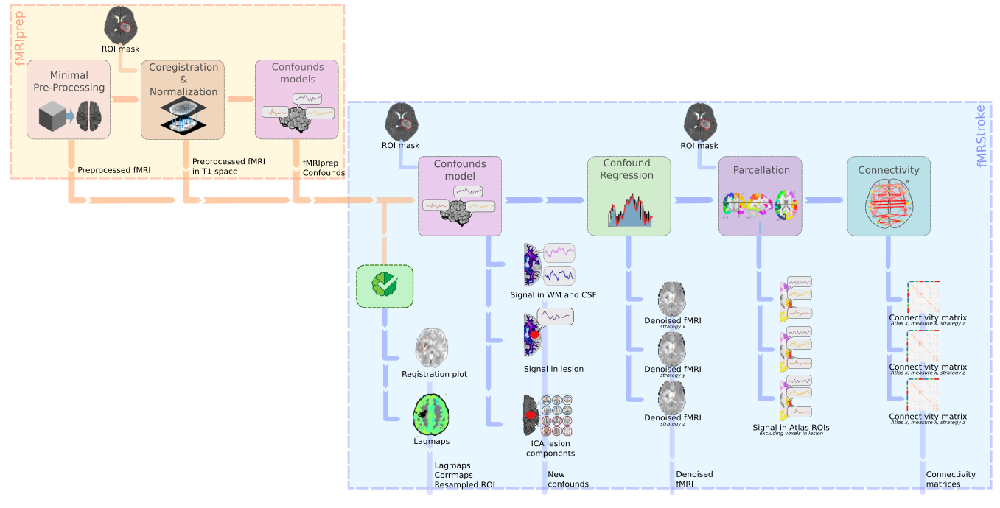

# Summary
Functional Magnetic Resonance Imaging (fMRI) is a widely used neuroimaging technique for the analysis of neural activity and functional connectivity. However, the fMRI signal is inherently noisy and susceptible to various artifacts, compromising the accuracy and reliability of derived analyses. This becomes particularly critical when dealing with stroke patients, given the added complexity associated with their neurological condition. Specific preprocessing and denoising are integral steps to identify the nuisance sources and mitigate their effect on fMRI analysis. 
To address these challenges, we present fMRIStroke, a dedicated preprocessing pipeline designed specifically for the quality control and preprocessing of fMRI data from stroke patients. fMRIStroke operates as an enhancement to standard preprocessing workflows. Building on the outputs from commonly used tools like fMRIprep, fMRIStroke introduces additional quality control visualizations, computes supplementary confounding variables, and performs confound regression (denoising), resulting in preprocessed fMRI data that is ready for subsequent analysis of neural activity or connectivity.

# Statement of need
Stroke, with its complex and varied impact on the brain's vascular supply, often results in damages that extend beyond the immediate lesion site, making functional connectivity analysis a promising tool to understand its immediate impact as well as network reorganizations during recovery. 

However, while the Blood Oxygen Level Dependent (BOLD) signal obtained from fMRI data is typically mixed with non-neuronal sources of variability [@Bianciardi:2009] in healthy subjects, it is even more true for stroke patients [@Siegel:2017], compromising the reliability of fMRI analyses and specifically Functional Connectivity (FC) analysis. 
Recognizing these challenges, it is highly recommended, notably by @Siegel:2017, to incorporate specific quality controls and strategies to address lesion-related confounds when working with stroke fMRI data. 

Existing tools like fMRIprep [@Esteban:2019] have streamlined most of the preprocessing steps; however, they lack specificity for fMRI data from stroke patients. 

To this end, we propose fMRIStroke, a fMRI preprocessing pipeline designed specifically for stroke data that builds on the output derivatives of fMRIprep [@Esteban:2019] when a lesion mask is given. It provides an interface requiring minimal user input while delivering easily interpretable and comprehensive reports. 

Concretely, novel quality controls include a hemodynamic lagmap. fMRIStroke assesses hemodynamic lag using cross-correlation with the global gray matter signal [@Siegel:2016] using the rapidTide Python library [@Rapidtide]. As stroke can introduce altered blood flow patterns a normal hemodynamic response cannot be assumed. @Siegel:2016 investigated temporal delays (lag) in resting state functional magnetic resonance imaging signals and found that significant hemodynamic lag was observed in 30% of sub-acute stroke patients and approximately 10% of patients at one-year post-stroke. 
Lags systematically alter measurements of functional connectivity from the affected nodes, and need to be taken into consideration when doing FC analysis [@Siegel:2017].

Additionally, signal in the lesion mask and signals in CSF and WM masks incorporating lesion masks are added to the confounds already computed by fMRIprep along with new ICA-based confounds inspired by @Yourganov:2017 proposed method. In this paper the authors point out that the lesion introduces a particular artefact into the fMRI data which is not removed by standard preprocessing techniques. To mitigate this effect, they propose an ICA-based noise identification method. Independent components are calculated on the BOLD signal and those that overlap with the lesion (that is unlikely to include signal related to neuronal activity), are identified as potential noise components. Signals extracted from ICA components can be further regressed out from the fMRI data with a denoising procedure.

Finally supplementary outputs include the lesion mask in standardized space and multiple denoised fMRI data as there is currently no consensus in the fMRI community on an optimal denoising strategy.

fMRIStroke pipeline is presented in more details in the following figure. 

# Acknowledgements
This work was made possible thanks to the labex Cominlabs, as part of the PEPERONI project. 

# References
